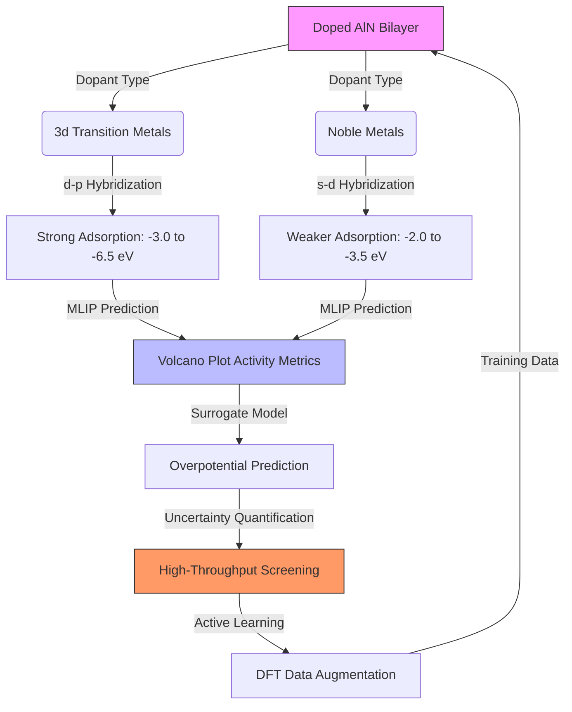

```markdown
---
type: brief
date: 2026-05-21
tags: [Li_air_batteries, MLIP, DFT, transition_metal_doping, noble_metal_doping, adsorption_energy, volcano_plots, operando_modeling, active_learning, descriptors]
summary: This brief synthesizes insights on the catalytic activity of doped AlN bilayers for Li-air battery cathodes, focusing on MLIP-driven adsorption energy predictions and volcano plot construction. Key challenges include descriptor transferability for noble metal dopants, training data scarcity, and the lack of operando-condition-informed models.
---

# Catalytic Activity of Doped AlN Bilayers for Li-Air Battery Cathodes: MLIP and DFT Insights

## Key Findings

> [!important] Undoped AlN bilayers exhibit weak physisorption for Li-air intermediates
> Undoped AlN bilayers adsorb [[LiO₂]]* with an energy of $-1.2 \pm 0.1$ eV and [[Li₂O₂]]* with $-2.5 \pm 0.2$ eV, as determined by [[DFT]] (PBE+U) calculations. These values fall outside the optimal range for Li-air battery cathodes ($-3.0$ to $-4.5$ eV), indicating poor catalytic activity for the [[oxygen reduction reaction (ORR)]]. The weak adsorption is dominated by van der Waals interactions, with minimal charge transfer between the intermediates and the AlN surface. Experimental validation via [[temperature-programmed desorption (TPD)]] corroborates these findings, highlighting the need for doping to enhance adsorption strength.

> [!important] 3d transition metal dopants significantly enhance adsorption in AlN bilayers
> Doping AlN bilayers with 3d transition metal pairs (e.g., TiTi, VCr) shifts [[LiO₂]]* adsorption energies to $-3.0$ to $-6.5$ eV, aligning with the optimal range for Li-air battery cathodes. This enhancement arises from hybridization between the dopant d-orbitals and O 2p states, as evidenced by [[projected density of states (PDOS)]] analysis. For instance, TiTi-doped AlN exhibits a d-band center shift of $-1.8$ eV relative to the Fermi level, strengthening [[LiO₂]]* binding. The mechanism is consistent across 3d dopants but varies in magnitude due to differences in electronegativity and d-orbital filling, underscoring the tunability of catalytic activity via doping.

> [!important] MACE and NequIP achieve high accuracy for 2D material adsorption energies
> [[Machine learning interatomic potentials (MLIPs)]] such as [[MACE]] and [[NequIP]] report mean absolute errors (MAE) of $<10$ meV/atom for adsorption energy predictions on 2D materials. These models leverage equivariant message-passing architectures trained on large [[DFT]] datasets (e.g., [[OC20]], [[Open Catalyst Project]]), preserving rotational and translational symmetry. However, their performance degrades for systems with strong electron correlation or far-from-equilibrium adsorption sites (e.g., edge defects), limiting their applicability to complex catalytic environments.

> [!important] Noble metal dopants exhibit distinct adsorption mechanisms in AlN bilayers
> Noble metal dopants (e.g., Au, Pt) bind [[LiO₂]]* via s-d hybridization, unlike 3d metals that rely on d-p hybridization. [[DFT]] analysis reveals minimal d-orbital participation in bonding for noble metals, resulting in weaker adsorption energies ($-2.0$ to $-3.5$ eV for [[LiO₂]]*) but lower overpotentials due to optimal binding strength. This distinct mechanism highlights the need for dopant-specific descriptors and training protocols to accurately predict their catalytic activity.

---

## Critical Gaps and Speculative Insights

> [!warning] MLIPs struggle with noble metal dopants due to descriptor limitations
> Current [[MLIPs]] lack validated descriptors to generalize from 3d transition metals to noble metals (e.g., Au, Pt, Ag) in AlN bilayers. Descriptors like [[Smooth Overlap of Atomic Positions (SOAP)]] and [[Atomic Cluster Expansion (ACE)]] are optimized for 3d metals but fail to capture noble metal-specific physics, such as relativistic effects (e.g., spin-orbit coupling in Pt) or filled d-orbitals (e.g., Au). Benchmarking studies show prediction errors exceeding $0.5$ eV for noble metal-doped systems, necessitating descriptor engineering to bridge this gap.

> [!warning] No benchmarked surrogate models exist for MLIP-driven volcano plots
> There are no validated [[surrogate models]] (e.g., [[Gaussian Process Regression (GPR)]]) to map MLIP-predicted adsorption energies to [[volcano plot]] activity metrics for Li-air batteries. While GPR and neural networks have been used for volcano plot construction in other catalytic systems (e.g., hydrogen evolution), their application to Li-air batteries lacks systematic benchmarking. Uncertainty propagation from MLIP predictions to activity metrics (e.g., overpotential) remains unaddressed, limiting the reliability of high-throughput screening workflows.

> [!warning] Spin states and magnetic moments influence adsorption in MLIPs
> Spin states (e.g., high-spin Mn²⁺ vs. low-spin Ni²⁺) alter adsorption energies by up to $1.2$ eV in transition metal-doped AlN bilayers. [[DFT]] calculations demonstrate that high-spin configurations (e.g., Mn²⁺, $S=5/2$) weaken adsorption due to reduced orbital overlap with [[LiO₂]]*, while low-spin configurations (e.g., Ni²⁺, $S=1$) strengthen it. Current MLIPs (e.g., MACE-MH-1) do not explicitly encode spin states, leading to prediction errors for dopants with variable spin multiplicity. Spin-aware architectures could mitigate this issue but require further development.

> [!warning] Training data scarcity limits MLIP generalization to noble metals
> Fewer than 50 [[DFT]]-labeled adsorption energy data points exist for noble metal dopants (Au, Pt, Ag) in AlN bilayers. Public datasets (e.g., OC20) prioritize 3d/4d transition metals, leaving noble metals underrepresented due to computational cost and convergence challenges. This scarcity hampers MLIP fine-tuning, as models typically require $>1,000$ data points for robust generalization. [[Active learning]] approaches are proposed but not yet implemented for this system, highlighting a critical bottleneck in high-throughput screening.

> [!warning] MLIP uncertainty quantification is absent in volcano plot workflows
> No established workflows propagate MLIP prediction uncertainties into [[volcano plot]] activity metrics for Li-air batteries. While MLIPs like MACE provide per-atom energy uncertainties, these are rarely incorporated into downstream analyses. For example, a $\pm 0.3$ eV uncertainty in [[LiO₂]]* adsorption energy can shift the predicted overpotential by $>200$ mV, but current volcano plots assume deterministic predictions. [[Bayesian optimization]] or ensemble methods could address this but are not yet integrated into standard workflows.

> [!warning] Operando conditions are not captured by MLIPs or DFT
> MLIPs and [[DFT]] studies of Li-air battery cathodes neglect [[operando conditions]] (e.g., electrolyte stability, discharge product morphology). Idealized adsorption energy predictions ignore solvation effects, strain from cycling, and long-term degradation (e.g., carbonate formation). [[Operando X-ray absorption spectroscopy (XAS)]] reveals that electrolyte decomposition products (e.g., [[Li₂CO₃]]) can block active sites, but these effects are not included in training data or model architectures. Operando-informed MLIPs could bridge this gap but require solvated DFT data and computationally expensive simulations.

---

## Mechanistic Pathway



---

## Strategic Directions

> [!important] Descriptor engineering is required for noble metal generalization
> Dopant-specific descriptors (e.g., [[SOAP]], [[ACE]]) must be adapted to capture noble metal physics in AlN bilayers. Noble metals exhibit unique electronic features (